## Instalando e abrindo o processing no QGIS
O processing é um complemento que normalmente já vem instalado no QGIS, porém para usá-lo é necessário ativar antes. Para ativá-lo, vá em: Complementos >  Gerenciar e Instalar Complementos, como mostrado na figura abaixo:

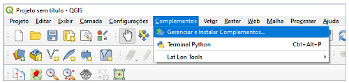

Na tela que se abre em seguida, clique em “instalados”. Dê um check ao lado da opção Processing.

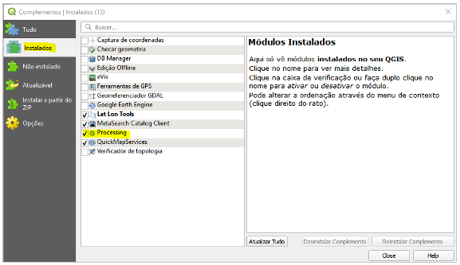

Na aba “Opções” deve ser encontrada a opção “Processar” (ou “Processing” na versão em Inglês). Clique nela e em seguida em “Caixa de ferramentas”. 

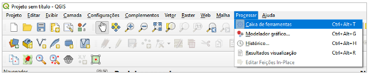

No lado direito aparecerá a caixa de ferramentas de processamento. Nela, é possível encontrar vários processings nativos e outros pacotes de processings, como o GRASS, conforme mostrado na figura abaixo:

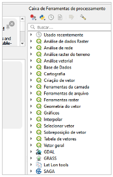

Na Caixa de Ferramentas de processamento é possível encontrar a opção “Scripts”. Esta opção permite trabalhar com processings através de um script em Python. As opções são: “Criar novo script”, “Criar novo script a partir do modelo”, “Abrir script existente” e “Adicionar script à caixa de ferramentas”.

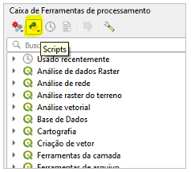

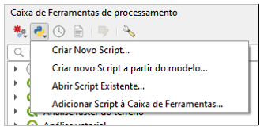

## Estrutura de um processing
Para usar um script de processamento é necessário clicar em “Criar novo Script a partir de modelo", na opção de script dentro da caixa de ferramentas. Uma tela nova abrirá com um modelo de script de um processing. Basicamente o script é dividido em quatro partes: importação dos objetos da API do QGIS, informações do algoritmo, definição dos parâmetros e lógica do algoritmo.

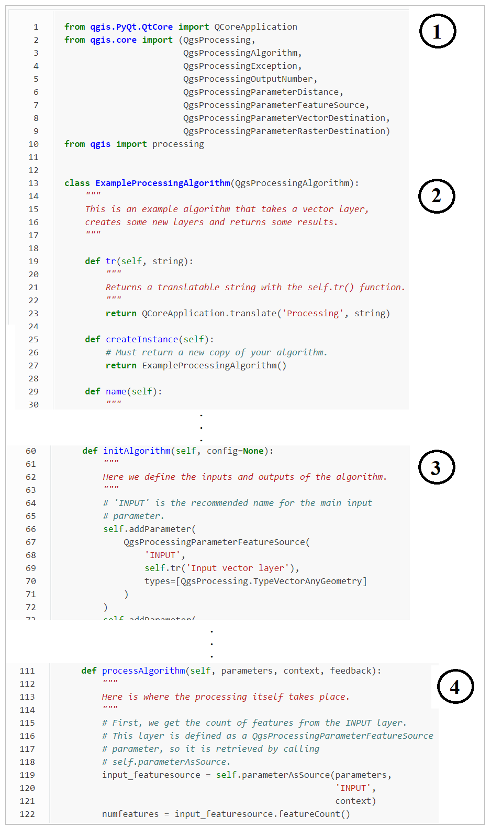

A primeira parte do algoritmo é a importação dos objetos da API do QGIS.

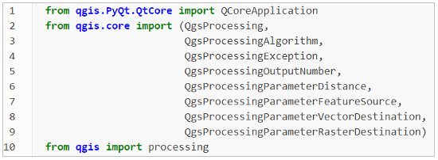

A segunda parte do algoritmo se refere às informações do algoritmo.

* Não se pode ter espaço entre os caracteres no nome da classe.

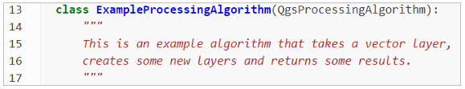

* O “tr” é utilizado para tradução da aplicação em diferentes línguas.

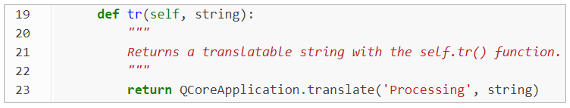

* “createInstance” retorna uma nova instância do algoritmo.

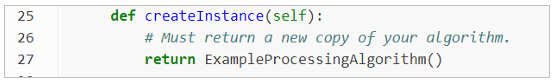

* “name” retorna o nome do algoritmo, sendo normalmente utilizadas letras minúsculas para isso.

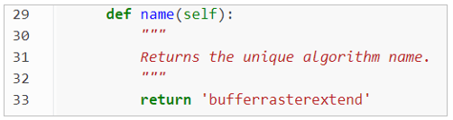

* “displayName” é o que aparece na tela do usuário que for usar o algoritmo. Além disso, também é o nome que aparecerá na Caixa de Ferramentas.

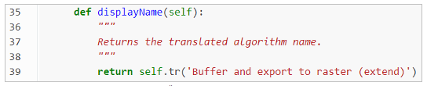

* “group” retorna o nome do grupo ao que o algoritmo pertence. Este grupo também aparece na Caixa de Ferramentas ao adicionar o script à Caixa de Ferramentas.

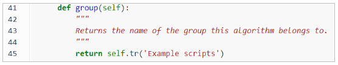

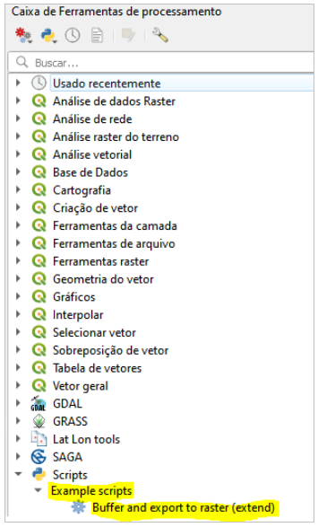

* “groupId” retorna o identificador único do grupo ao qual o algoritmo pertence. Normalmente, são usadas apenas letras minúsculas.

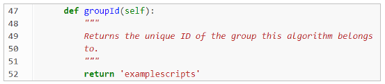

* “shortHelpString” retorna uma pequena explicação sobre o algoritmo, que  aparece na interface do usuário ao usar o processing.

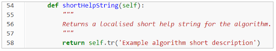

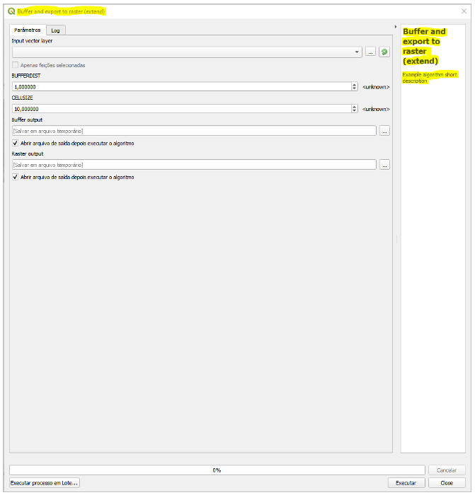

A terceira parte do algoritmo, definição dos parâmetros, é onde se define os inputs e outputs do processing. É possível definir, nessa parte, valores default de input, definir a unidade de medida e o tipo de entrada e saída. Esses parâmetros devem ser declarados dentro de “initAlgorithm”.

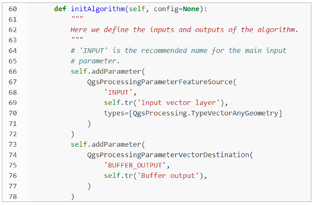

A quarta, e última parte, do processing, lógica do algoritmo, é onde ocorre toda a função a ser executada com os parâmetros de entrada e retornando as saídas. Esta parte normalmente se inicia acessando os parâmetros de entrada nos formatos desejados e que serão utilizados ao longo do código. Essa parte deve ficar dentro de “processAlgorithm”.

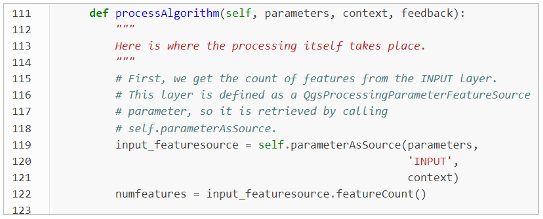

## Executando o processing via Python
A execução de processings pode se dar por meio do console Python existente no QGIS. Isso ocorre através de uma estrutura fixa e menos intuitiva, porém de grande utilidade, uma vez que o usuário pode entender cada passo que será executado pelo processing e identificar possíveis erros.

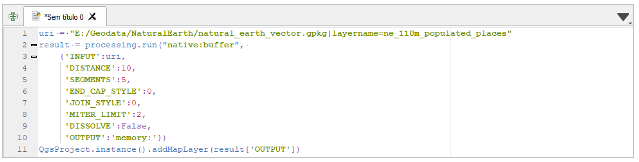

Na linha 1 é carregada a camada como “uri”. A seguir, processing.run() é o que de fato executa o processing sobre a camada de entrada. Em seguida, são informados os parâmetros e as camadas de entrada, sequencialmente, e separados por vírgula. Veja que pode ser necessário mais de uma camada de entrada, nesse caso existiria mais de um ‘INPUT’ e seria necessário carregar mais camadas antes, por exemplo uma “uri_2”.

Na janela à esquerda dos resultados do código rodado, aparecem diversas informações acerca do processing, incluindo o que ele faz, os campos a serem preenchidos e o tipo de cada elemento.

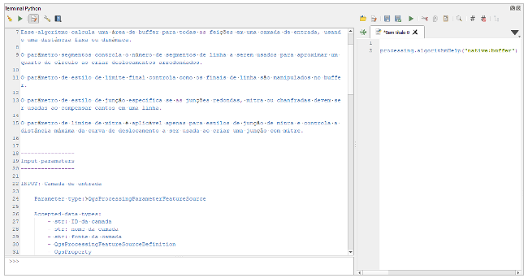

## Executando o processing em série (GRASS e Nativo)
Executar processings em série, na interface do PyQGIS, nada mais é do que executar sucessivamente vários processings, usando a saída de um (output) como parâmetro ou entrada (input) de outro. Para isso, é necessário conhecer exatamente o nome do processing e os parâmetros de entrada.

No exemplo abaixo, inicialmente, carrega-se três camadas e define-se “expression”. O primeiro processing então é executado, e o resultado é salvo como “danube”.

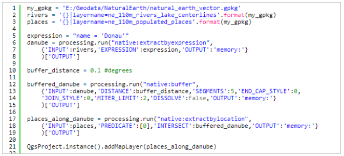

A seguir mais uma variável é definida e o segundo processing é executado. Perceba que na entrada dele é passado o resultado do primeiro, “danube”. Por fim, o procedimento é repetido para o terceiro processing, e o resultado final é exibido no QGIS pelo comando da linha 21.

## Definindo parâmetros de entrada e saída
Os parâmetros são definidos na função "InitAlgorithm(self, config = none)”. Sucessivamente, são definidos os INPUTs, parâmetros auxiliares e OUTPUTs.

* **INPUTS:** é importante definir o tipo de camada de entrada, como Point, Line ou Polygon, na última linha.

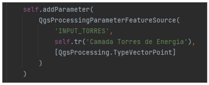

* **Parâmetros:**

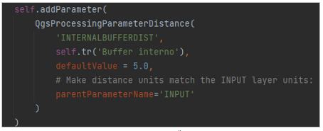

* **OUTPUTS:**

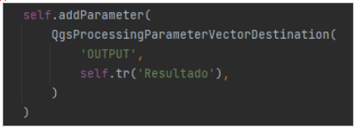

Após definir os parâmetros na parte “def InitAlgorithm()”, é importante chamá-los no código principal. A estrutura para realizar essa chamada é sempre a mesma:

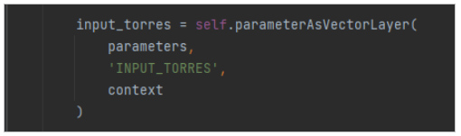

## Executando processing dentro do processing
É possível, e às vezes bastante útil, executar um processing já existente dentro de um processing que esteja sendo criado. Para isso, utiliza-se uma estrutura bastante similar à execução de processing na interface em Python do QGIS.

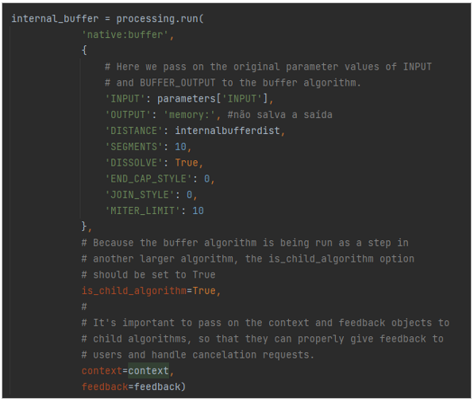

Os processings são chamados na parte do código principal, em “def processAlgorithm( )”, conforme a figura acima. Após isso, o resultado do processing é salvo no parâmetro de “processing.run( )” e pode ser utilizado futuramente no código.

## Modificando camadas vetoriais via processing
É possível adicionar feições às camadas vetoriais utilizando-se o recurso “addFeatures( )”, conforme a figura abaixo:

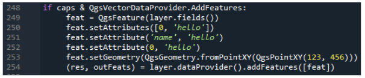

É possível também excluir feições com o recurso “deleteFeatures( )”.

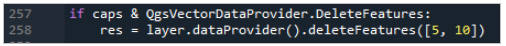

É possível modificar feições com o recurso “changeAttributeValues( )”, no caso de valores de atributos, ou “changeGeometryValues( )”, no caso de geometria.

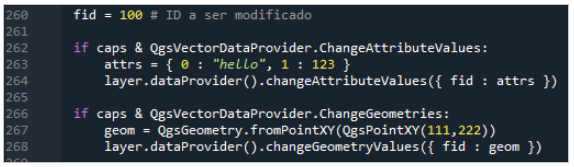

## Usando o feedback no processing
Algumas etapas dentro do processing podem levar um longo tempo para serem executadas, fazendo com que o usuário não tenha controle sobre a etapa que está sendo realizada. Um recurso que pode ajudar nesse problema é o “feedback”.

O feedback é feito através do comando “feedback.setProgressText(‘Digite aqui o feedback...’)” e é posto ao longo do código antes da etapa na qual se deseja localizar.

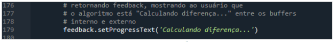

No código acima, pode-se notar o feedback na linha 179, que auxilia o usuário a saber em qual etapa do processing encontra-se, no caso, se já está “Calculando diferença”. Portanto, é indicado seu uso antes de cada etapa do processing.

## Classes QgsProcessingParameter

Algumas classes muito interessantes no desenvolvimento PyQGIS são as do tipo **QgsProcessingParameter**. Abaixo, listamos aquelas bastante utilizadas em nossos códigos:

* QgsProcessingParameterVectorLayer (<https://qgis.org/pyqgis/master/core/QgsProcessingParameterVectorLayer.html>)

* QgsProcessingParameterFeatureSink (<https://qgis.org/pyqgis/master/core/QgsProcessingParameterFeatureSink.html>)

* QgsProcessingParameterNumber (<https://qgis.org/pyqgis/master/core/QgsProcessingParameterNumber.html>)

* QgsProcessingParameterMultipleLayers (<https://qgis.org/pyqgis/master/core/QgsProcessingParameterMultipleLayers.html>)

* QgsProcessingParameterField (<https://qgis.org/pyqgis/master/core/QgsProcessingParameterField.html>)

* QgsProcessingParameterString (<https://qgis.org/pyqgis/master/core/QgsProcessingParameterString.html>)

* QgsProcessingParameterFeatureSource (<https://qgis.org/pyqgis/master/core/QgsProcessingParameterFeatureSource.html>)
