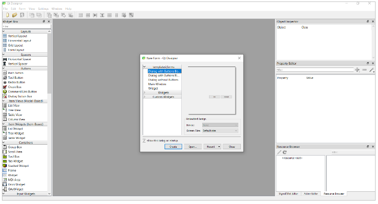

Plugins são programas, ou extensões, com o objetivo de adicionar recursos e funcionalidades extras a algum programa principal. Os plugins são ferramentas essenciais em diversos programas, pois, como no caso do QGIS, possibilitam desenvolvedores de incrementarem as ferramentas disponíveis conforme as necessidades encontradas, não requisitando do criador do programa base a inserção daquela funcionalidade. Com isso, é possível baixar extensões, criadas pelos desenvolvedores do QGIS, ou independentes, que atuem mais especificamente no tema demandado.

## Criando um plugin no QGIS
São necessários alguns passos para a criação de um plugin no QGIS. Abaixo, listamos eles:
* Instalar o Plugin Builder 3 no QGIS. Na aba “Complementos”, clicar em “Gerenciar e Instalar Complementos...”.

* Pesquisar “Plugin Builder”.

* Clicar em “Instalar complemento”.

* Abrir a aba “Complementos”, ir em “Plugin Builder” e abrir o “Plugin Builder”.

* Preencher os seguintes campos:
  * **Class Name:** Nome para criar a classe Python do plugin.
  * **Module Name:** Nome para criar o módulo (arquivo) do plugin.
  * **Plugin Name:** Título para o Plugin (no plugin manager e instalador).
  * **Description:** Descrição breve da função do plugin.
  * **Version Number:** Número da versão do plugin, sugestão 0.1.
  * **Minimum QGIS Version:** Versão do QGIS necessária para o plugin funcionar.
  * **Author:** Autor do plugin.
  * **Email Address:** Email para contato dos usuários do plugin.

* Preencher a descrição detalhada do plugin.

* Escolher o tipo de plugin a ser criado e o texto para ser exibido no menu. Escolher o menu em que aparecerá o plugin.

* Escolher os componentes adicionais do plugin:
  * **Internationalization:** Adicionar textos transcritos ao plugin.
  * **Help:** Cria um arquivo de ajuda.
  * **Unit tests:** Cria conjunto de testes para o plugin.
  * **Helper scripts:** Adiciona um script de ajuda para o plugin.
  * **Makefile:** Adiciona um Makefile para o plugin.

* Preencher também:
  * **Bug Tracker:** Url para o bug tracker do plugin.
  * **Repository:** algum repositório como GitHub
  * **Home page (opcional):** página do plugin
  * **Tags (opcional).**

## QT Designer
A utilização do Qt Designer é muito indicada por alguns motivos. Primeiramente, ele é um programa simples e com muitas funcionalidades para a criação de UIs (User Interfaces), permitindo ao desenvolvedor modelar uma interface da forma que quiser de maneira visual e prática. Além disso, outra grande vantagem do programa é já vir instalado com o QGIS, havendo uma boa integração entre os programas. Assim, qualquer máquina com o QGIS instalado deve ter o Qt Designer a parte, como na figura abaixo.

Ao abrir o programa, a seguinte janela aparecerá:

Selecione “Create”, criando, assim, uma caixa de diálogo com botões, fazendo com que seja possível criar uma interface do zero. Assim, chega-se ao programa em si, que pode ser dividido em partes, conforme será explicado abaixo.

**1. Caixa de Ferramentas (Widget Box)**
Os elementos da interface podem ter diversas funcionalidades, sendo classificados como widgets e divididos em tipos, tendo cada um a sua especificação.  Ao arrastar um desses widgets para a sua interface, ele será adicionado e pode ser customizado de várias formas. Existem mais widgets ainda do que mostrados na imagem abaixo, alguns com funcionalidades específicas para o QGIS, inclusive. 

**2. Configuração de layout:**

Nesta parte, as várias formas de configuração de layout são disponibilizadas e podem ser inseridas para a estruturação dos elementos na interface. Podem ser vistos os formatos verticais, horizontais, agrupados, entre outros. Apesar de não parecer muito essencial num primeiro momento, a formatação de layout é muito importante para a esquematização da interface, ordenamento dos itens e facilita também a mudança de escala e espaçamento da interface.

**3. Inspeção de objeto**
Nesta aba, os elementos gráficos serão mostrados de forma hierárquica, assim sendo importante alterá-la se for necessária uma variação em caso de sobreposição. Aqui também é mostrado a estruturação de layouts que podem estar presentes e quais elementos estão inseridos nele, como no exemplo ao lado com um formato de grupos e 3 Check Boxs existentes.

**4. Editor de propriedades**
Por fim, a aba de edição das propriedades de um elemento. Essa é uma das abas mais importantes, pois nela é possível editar praticamente qualquer característica do elemento inserido. 

Entre essas alterações, pode-se mexer na geometria, nome, fonte e mais funcionalidades. Essas características também podem ser alteradas por código, ao se criar o plugin em si. Esse editor também mostra o nome do elemento, que deve ser utilizado se necessário via código.

